IC ESP32 OTA

Permet le contrôle à distance de la borne de recharge [VE-TRONIC WB-01](http://ve-tronic.fr/store/wallbox) par [Jeedom](https://www.jeedom.com) (ou tout autre domotique) via un ESP32.

## Présentation

Ce projet permet de communiquer en RS232 avec la borne VE-TRONIC par l'intermédiaire d'une requête HTTP. 
La commande à envoyer à la borne est intégrée à la requête HTTP et l'ESP32 retourne un résultat en XML que Jeedom (ou autre logiciel de domotique) pourra facilement interpréter. 
Côté Jeedom, il faut juste utiliser le plugin [Script](https://market.jeedom.com/index.php?v=d&p=market_display&id=20) et d'utiliser le parser XML intégré pour récupérer les valeurs. Pour envoyer une commande à la borne, le même plugin permet d'envoyer une requête HTTP simplement.

[UPDATE] A partir de la version V2.0, le module peut mettre à jour automatiquement les commandes Infos de Jeedom par requête URL HTTP. Pour celà, il faudra configurer l'adresse IP et la clé API de Jeedom ainsi que les ID des commandes. Il n'est donc plus nécessaire de passer par le plugin script pour faire une interrogation périodique.

Pour faciliter la configuration et la maintenance logicielle du module ESP32, un serveur Web est intégré ainsi que le manager WiFi [AutoConnect](https://github.com/Hieromon/AutoConnect) permettant la configuration du WiFi mais également la mise à jour du firmware de l'ESP32 par OTA.
Le serveur web intégré à l'ESP32 permet d'envoyer des commandes manuellement à la borne et d'afficher la réponse retournée via une IHM simple.
La première programmation de l'ESP32 devra être réalisé par USB, les mises à jours pourront être faites directement depuis la page Web en sélectionnant le fichier binaire à charger.

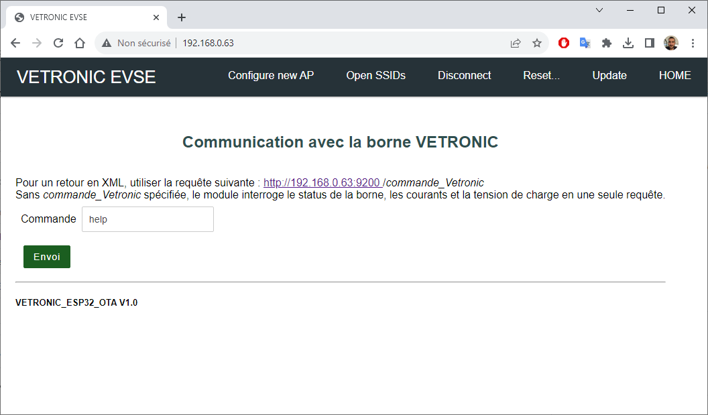

## Materiels

- [ESP32 NodeMCU](https://www.amazon.fr/dp/B071P98VTG) (ou un de ses nombreux clones)

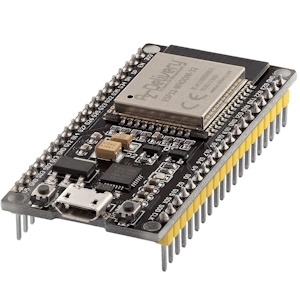

- [Une Board MAX3232](https://www.amazon.fr/gp/product/B07ZDK4BLH)

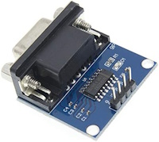
- [Une alimentation 230V vers 5V](https://www.amazon.fr/dp/B00WKKG7CI), j'ai utilisé un bloc secteur de raspberry que j'avais en stock.

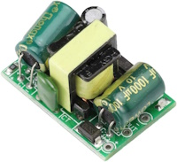
- [un Câble SUBD 9 points mâle / mâle croisé](https://www.amazon.fr/dp/B08LPT8RMF?th=1) pour ma part je l'ai fabriqué en achetant 2 prises SUBD 9 points mâle et du câble électrique pour le faire à la bonne longueur. 

## Câblage

Le câblage de l'ESP32 vers la board RS232 est assez simple, 4 fils à raccorder comme suit:

| ESP32 |     | MAX3232 |
| :---- | :-: | ------: |
| 3V3  | ->  |     VCC |
| GND     | ->  |     GND |
| D15    | ->  |      RX |
| D4    | ->  |      TX |

Côté borne, on récupére l'alimentation 230V sur le bornier du bas le plus à gauche pour y connecter l'alimentation 5V.
On raccorde ensuite le câble RS232 croisé sur le connecteur SUBD en haut à droite.

Si vous voulez connaitre le courant de charge réel envoyé au véhicule, il faudra y raccoder un tore et le monter sur le fil de phase qui part au VE. 
Voir la documentation de la borne: [Documentation WB-01](./docs/wallbox_WB-01_V15A.pdf)

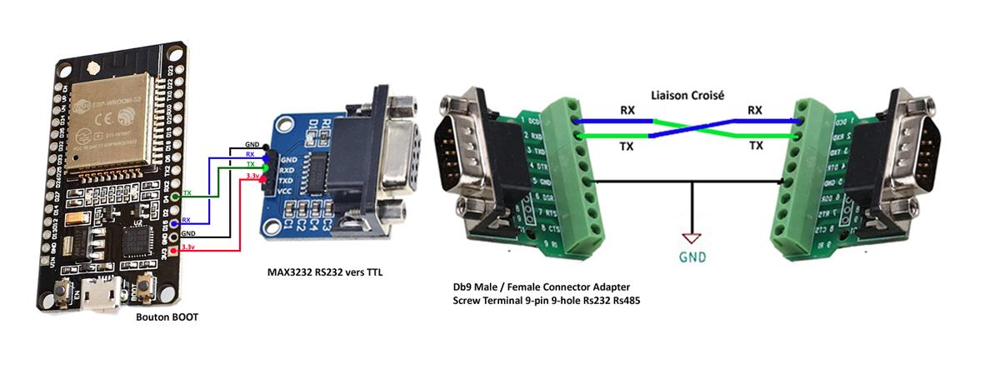

## Intégration dans la borne

Voici mon installation provisoire, j'ai prévu de mettre l'ESP32 et la board RS232 sur un support en impression 3D que je ferais plus tard.
Sur la photo, on voit l'alimentation de la raspberry qui a été ouverte pour y souder les 2 fils 230V.

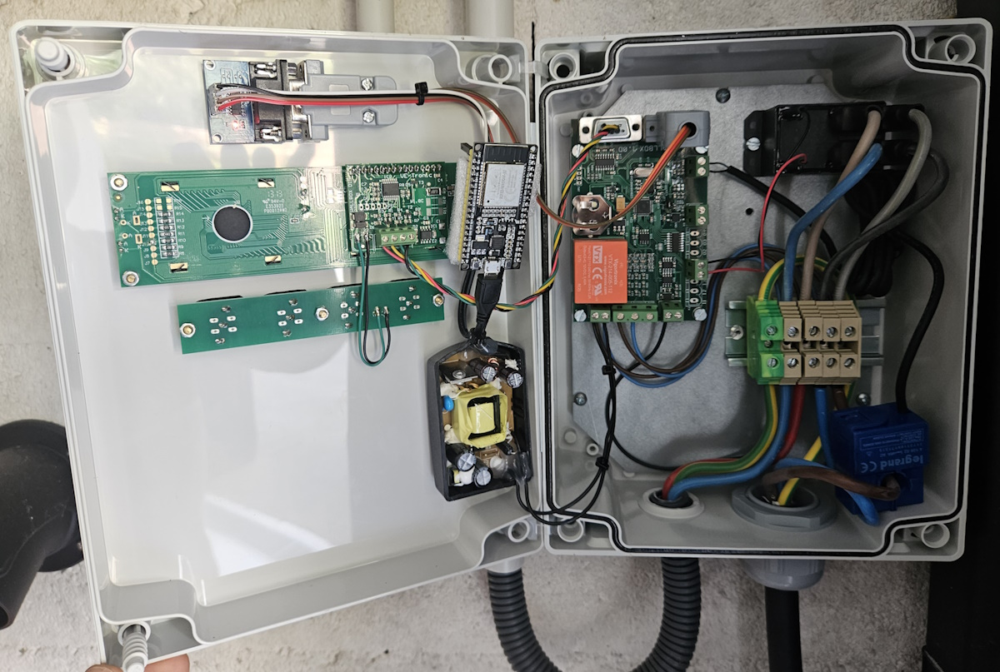

## Installation du programme dans l'ESP32

1. Installer [l'IDE Arduino](https://www.arduino.cc/en/software) 
2. Dans le gestionnaire de carte, rechercher et installer les cartes [esp32 par Espressif Systems](https://github.com/espressif/arduino-esp32 "esp32 par Espressif Systems")
3. Dans le gestionnaire de librairie, rechercher et installer les librairies suivantes:
	- [PageBuilder](https://github.com/Hieromon/PageBuilder "PageBuilder")
	- [ArduinoJson](https://github.com/bblanchon/ArduinoJson "ArduinoJson")
	- [AutoConnect](https://github.com/Hieromon/AutoConnect "AutoConnect")
4. Redémarrer l'IDE Arduino après avoir installé les packages
5. Charger le projet VETRONIC_ESP32_OTA.ino
6. Sélectionner la carte "ESP32-WROOM-DA" ou autre en fonction de votre module ESP32
7. Raccorder votre ESP32 à votre ordinateur et installer les drivers USB / RS232 correspondant
8. Dans l'IDE Arduino, sélectionner le port COM correspondant à l'ESP32
9. Compiler puis téléverser le code dans l'ESP32

## 1er démarrage du module ESP32

Au 1er démarrage, le module ESP32 va démarrer en point d'accès WiFi.
1. Rechercher et connectez vous au WiFi: ***VETRONIC_ESP32_OTA***, le mot de passe est ***12345678***
2. Normalement votre smartphone ou tablette devrait vous demander de vous connecter à la page du serveur, si ce n'est pas le cas, connectez vous à l'adresse IP suivante: ***172.0.0.1***
3. Cliquer sur ***Configure new AP*** et sélectionner votre borne WiFi.
4. Le module redémarre et bascule sur le WiFi que vous avez configuré, il vous faudra alors récupérer son adresse IP dans votre routeur ou votre box internet. Je vous conseille de le mettre en IP fixe pour ne pas à reconfigurer Jeedom en permanence.

## Mise à jour du firmware du module ESP32

Une fois que le module ESP32 est programmé et configuré une première fois, vous pouvez mettre à jour le firmware depuis la page web du module.
1. Connecter vous au module, l'adresse IP dans mon exemple est http://192.168.0.63, elle sera différente chez vous !
2. Sélectionner le fichier .bin se trouvant dans le répertoire Firmware_ESP32 de se dépot. 
3. Cliquer sur Update
4. A la fin de l'update, patienter jusqu'au rechargement de la page web.

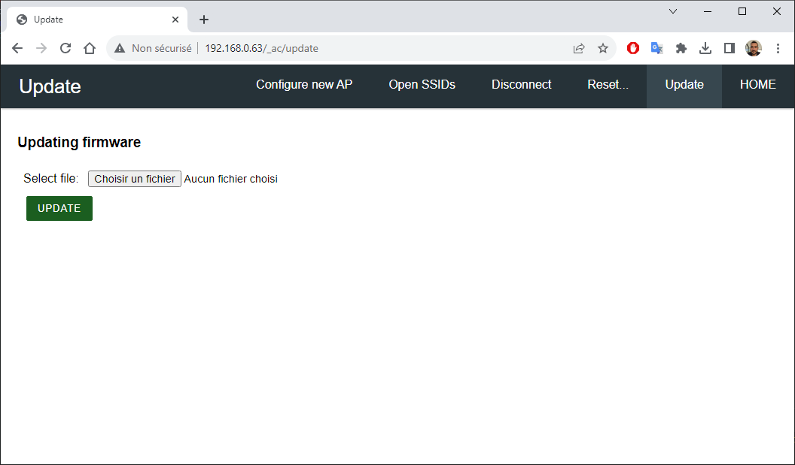

## Utilisation 

Il y a 2 façons d'utiliser ce module: 
- la première est par la page web de l'ESP32
- la seconde est par requêtte HTTP à l'adresse du module, sur le port 9200, qui retourne un XML. 

La page Web a été conçu pour du test manuel et pour voir ce que répond la borne, toutefois, elle peut être utilisé pour configurer la borne.
La requête HTTP avec retour XML est destiné à la connection avec Jeedom ou autre logiciel de domotique prenant en charge le XML.

### Interrogation de la borne par la page Web

Depuis la page Home accessible à l'adresse IP du module ESP32, il suffit de saisir la commande et de cliquer sur ***Envoi***.
La commande ***help*** vous donnera toutes les commandes disponible sur la borne.

### Interrogation par requête HTTP avec retour XML

Pour interroger la borne et obtenir un retour en XML, il suffit d'envoyer une requête sur le port 9200 en ajoutant la commande. 
http://192.168.0.63:9200/commande

Si vous ne spécifiez pas de commande, alors le module effectuera les 2 commandes evse_state et $GG*B2 automatiquement et retournera le résultat en une seule requête. C'est la requête qui va être utilisé par Jeedom pour récupérer l'état complète de la borne. 

Exemple pour la commande ***help*** : http://192.168.0.63:9200/help
Vous obtenez alors la réponse XML suivante:

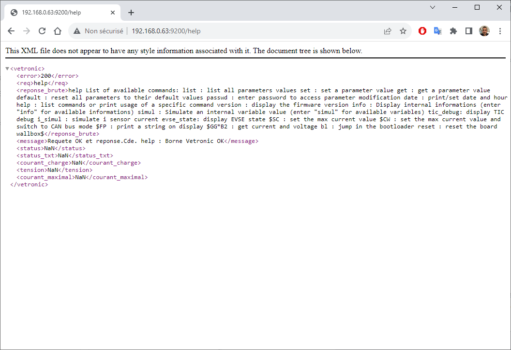

Le XML possède les TAGs suivants:

***- error*** qui peut prendre les valeurs suivantes: 
- 200 = Pas d'erreur, réponse correcte à la requête
- 444 = Pas de réponse de la borne (Timeout COM RS232)
- 400 = Si la borne ne répond pas correctement à la requête

***- req*** qui contient la commande demandée.

***- reponse_brute*** qui contient la réponse brute de la borne sans aucun traitement.

***- message*** qui contient un message d'information du traitement fait par le module ESP32.

***- status*** qui contient le status de la borne au format numérique:
- Nan = Si la requête ne correspond pas à une demande de status
- 0 = Câble déconnecté
- 1 = Câble connecté
- 2 = Véhicule en charge

***- status_txt*** qui retourne le status de la borne au format texte.

***- courant_charge*** qui correspond au courant lu par le tore en **mA**.

***- tension*** qui correspond à la tension appliquée sur la prise du véhicule en Volts.

***- courant_maximal*** qui correspond à la limitation du courant de charge en **mA** que la borne applique. Lu à 0 si le véhicule n'est pas connecté.

Si la requête demandée à la borne ne permet pas de récupérer le status, la tension ou les courants, alors les valeurs seront à NaN.

## Version V1.x: Configuration de Jeedom par script lancé régulièrement

1. Il vous faut installer le plugin [Script](https://market.jeedom.com/index.php?v=d&p=market_display&id=20) depuis le market Jeedom et l'activer.
2. Créer un équipement et le configurer avec une Auto-actualisation à la minute et un délai d'actualisation à 5 sec.
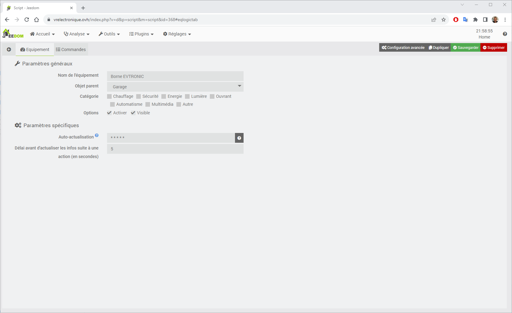
3. Créer les commandes avec les réglages suivants:
- Type script = XML
- Requête = le nom du TAG XML
- Paramètres = l'adresse IP du module ESP32 sur le port 9200 avec la commande de la borne si besoin
- Timeout à 5sec
- Nombre d'essais à 2

Voici un exemple de commande Jeedom:

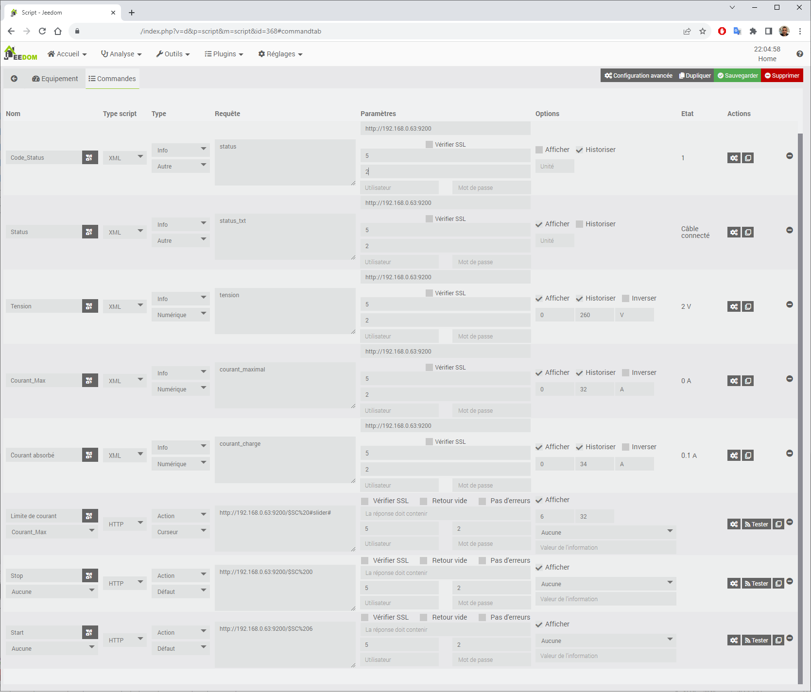

Ne pas oublier que la borne retourne les courants en mA, il vous faut les convertir en A depuis l'onglet de configuration de la commande:

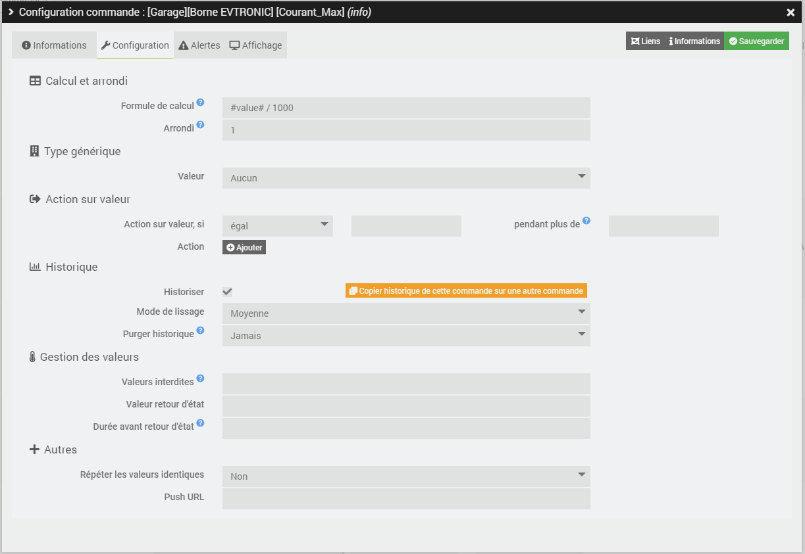

Pour obtenir le widget suivant:

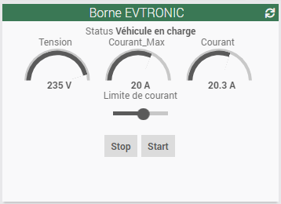

## A partir de V2.0: Configuration dans Jeedom pour mise à jour automatique des commandes infos

A partir de la version V2.0, un nouveau menu "Jeedom" est disponible pour renseigner les paramètres de connexion à Jeedom. Une fois renseigné, le module enverra automatiquement les mises à jours des infos à Jeedom quand elles changeront. 
Plus besoin de faire du polling avec le plugin Script.
L'envoi des commandes reste identique, j'ai mis à disposition un script php à mettre dans un bloc CODE d'un scénario pour envoyer la commande de réglage du courant qui est la seule nécessaire pour activer/couper la charge et régler le courant max.
1. Créer un virtuel avec les commandes que vous voulez récupérer, voici la liste disponible:
 - Status au format code numérique
 - Status au format Texte
 - Tension en volts
 - Courant consommé en mA (attention à convertir dans Jeedom)
 - Courant max en mA (attention à convertir dans Jeedom)
2. Configurer le module depuis le menu "Jeedom" accessible depuis la page Web du module
   - Renseigner l'adresse IP (IP locale uniquement)
   - Renseigner la clé API de votre Jeedom
   - Renseigner les numéros des commandes Jeedom. Mettre à 0 pour désactiver
   - Renseigner la fréquence de rafraichissement en msec de lecture de la borne. (0 pour désactiver et 2000 minimum) Jeedom ne recevra les données que si il y a un changement de valeur ou au démarrage du module.
  
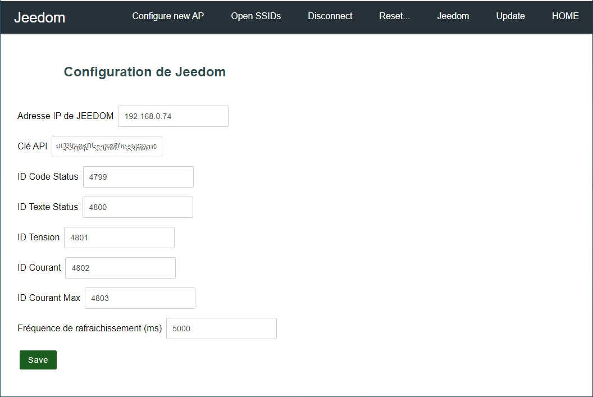

4. Créer un scénario avec un bloc CODE, dans ce bloc coller le script fourni : [Script PHP Jeedom](./Script%20Jeedom/code_scenario.php) 
5. Créer une commande dans votre virtuel qui lance ce scénario avec le TAG "courant", mettre la valeur du courant correspondant à ce que vous voulez faire.

## FAQ
**- Comment stopper la charge du VE ?**
	ll suffit d'envoyer un courant de limitation inférieure ou égale à 5A avec la commande $SC. Exemple: $SC 0 (pour 0A)
	
**- Comment démarrer la charge du VE ?**
	Il suffit d'envoyer un courant de limitation supérieure à 5A avec la commande $SC. Exemple: $SC 25 (pour 25A)
	A noter qu'envoyer la valeur -1 permet à la borne de sélectionner la limitation réglée depuis le menu paramètre de la borne.
	
**- Quelle est la limite de courant minimum ?**
	Pour le moment, la limite minimum est à 6A, en dessous la borne coupe la charge.

## Change log

### [v1.0] 5 août 2023
- Première version

### [v1.1] 19 août 2023
- Correction d'un break manquant dans le traitement d'une requête TCP.

### [v2.0] 27 août 2023
- Suppression du JSON pour décrire les pages Web, passage en AutoConnect Element natif (plus léger).
- Ajout des requêtes par URL HTTP pour la mise à jour de Jeedom automatiquement. Plus besoin de faire du polling.
- Ajout d'un menu "Jeedom" pour configurer les paramètres de connexions (IP, clé API) et les ID des commandes
- Lecture périodique de l'état de la borne (fréquence réglable) et envoi automatique à Jeedom si changement.

### [v2.2] 07 mai 2024
- Reconnexion automatique au point d'accès WiFi en cas de coupure d'électricité ou de redémarrage du WiFi
- Correction d'un bug sur l'envoi de requête URL HTTP (manque la fermeture du server)
- Filtrage des valeurs parasites de tension et de courant envoyé à Jeedom.
- Ajout de la fonction RTC locale avec mise à jour automatique de la date et heure et du changement d'heure
- Commande de l'écran de la borne qui affiche maintenant la tension, le courant de charge (si tore installé) et la limite de courant pendant la charge.

## License

License under the [MIT license](LICENSE).
